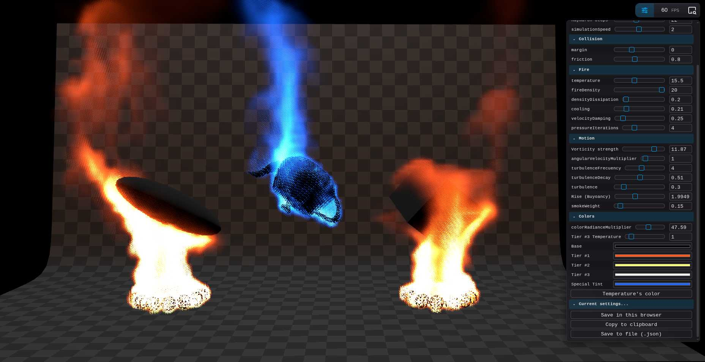

# Easy Fire
> Based on the [Three.js](https://threejs.org/) example "[Volumetric Fire](https://github.com/mrdoob/three.js/blob/master/examples/webgpu_volume_fire.html)" by [sunag](https://github.com/sunag). 

My motivation to make this module is to make adding fire something a bit easyer so the basics are somewhat covered and you can focus on the layers on top adding your artistic imprint. This fire class offers ways to edit the fire and extend it, so it serves as a very nice base to build on top of.

#### > Talk with the docs (+audio): [Gemini Notebook](https://notebook.google.com/notebook/2cc20d63-0ac7-4e18-880c-ce4545f1c2d7)

## Features
- Highly configurable + Automatic Inspector panel per instance.
- Collision detection: The fire interacts with dynamic colliders vía [Signed distance fields](https://en.wikipedia.org/wiki/Signed_distance_function)
- Supports for one unique special color ( on top of the base fire color )
- Extendable: add custom SDF Shapes. 
- Proxy system: When the fire is applied, you are offered a proxy object that you can control and the class will automatically keep everything in sync.
- Debug flags to visually see the colliders, bounding box of the simulation ( useful when things are not appearing where they should and you don't know why )

To see implementation code check **[the demo source](demo/demo.ts)**
Feed the llms.txt to your favourite assistant to know more.

> **The more you know:** this will create a total of 11 textures so be mindful of the resolution you chose (mayority will use the physics grid resolution). If you know how to optimize this, do a PR.

## Install

```bash
npm install threejs-easyfire
```

## Import

```js
import { EasyFire } from "threejs-easyfire";
```

## Setup
```js

// objects you want to burn...
const teapot = new Mesh(new TeapotGeometry(1, 11), new MeshNormalMaterial());
	scene.add(teapot);

// the fire volume handler. Add it to your scene.
const myFire = new EasyFire(renderer, {
	renderLayer: LAYER_VOLUMETRIC_LIGHTING,

	/**
	 * Play with these resolutions, it is a trial and error process
	 */
	size: {
		boundingBox: new Vector3(8, 8, 8), // volume world space size
		renderResolution: new Vector3(100, 100, 100), // rendering voxel size (visual)
		physicsResolution: new Vector3(80, 80, 80), // physics voxel size
	},

	steps: 22, // ray marching  ( more = nice look but slow )

	/**
	 * define the "template" for creating the burn effect of your desired meshes
	 */
	burnableMeshes: [
		{ geometriesInsideOf: teapot, maxCount: 1, id: "teapot" },
		//...
	],  
});

scene.add(myFire); //<--- Don't forget to add the volume to your scene.
```

## Set on fire
```js
teapot.add( 
	myFire.getFireFor("teapot") //will return a proxy Object3D that will represent the fire.
);
```

## Add a collider
```js
const box = new Mesh(new SphereGeometry(0.5), new MeshPhysicalMaterial({ color: "darkgrey" }));

box.scale.set(3, 0.5, 3.5); //change the size...
box.position.y = 1; 

scene.add(box); 

// flag it as a collider...
myFire.makeObjectCollidable(box, "ellipsoid");
```
#### Define a custom collider
Optionally you can create your own colliders using Signed Distance fields, just:

1. Create a class that extends `SDFShape`

```js
import { SDFShape } from "threejs-easyfire";
import { Node } from "three/webgpu"; 
import { abs, length, max, min } from "three/tsl";

export class MyCustomSDFBox extends SDFShape {
	override sdf(localPos: Node<"vec3">, halfExtents: Node<"vec3">): Node<"float"> {
		const q = abs(localPos).sub(halfExtents);
		return length(max(q, 0.0)).add(min(max(q.x, max(q.y, q.z)), 0.0));
	}
}

```
2. And add it to the EasyFire config:
```js
const myFire = new EasyFire(renderer, {
	//...
	collisions: {
		sdfShapes: [
			new MyCustomSDFBox(10,"myCustomBox") // says MAX count of this type will be 10
		]
	}
});
```
3. Use it...
```js
myFire.makeObjectCollidable(box, "myCustomBox");
```
To play with SDF Shapes and test things out if you are not familiar with sdf check out this all: ***[threejs-sdf-shapes playground](https://threejs-sdf-shapes.ai.studio/)***

## Initialize
Must call this before the scene renders, this will create 
```js
await myFire.initialize();
```

## Add it to your RenderPipeline
```js
const scenePass = pass(scene, camera);
const sceneDepth = scenePass.getTextureNode("depth"); // needs this

const fireScene = myFire.getRenderPass(scene, camera, sceneDepth);
const scenePassColor = scenePass.add(fireScene); // add on top of your scene...

renderPipeline.outputNode = scenePassColor;

```

## Render it
```js
yourRenderLoop( delta:number ) {

	box.rotateY(delta);
	teapot.rotateX(delta*0.1);

	// here you can move your objects, the teapot or the box...
	myFire.update?.(delta);
	
	renderPipeline.render();
}
```

## Tweak it / Design it
```js
myFire.addSettingsToInspector(renderer.inspector as Inspector, "Fire's Settings");
```
And vía the buttons provided there, download the json settins or copy them to clipboard, then...

## Grid Sizes
The volume has 2 voxel grids, the render grid and the physics grid, they have different purposes. When you see "voxel units" it means how many times the world volume will be sliced. 

> WARNING: I still feel these methods are unstable, the simulation behaves diferently depending on the size of the voxels, obviously, so yeah, if you reduce the voxels too much it will act weird and explode or if there are too many too tiny they will be hard to notice unless you increase temperature and touch the settings again. Just a heads up.

- **renderResolution**: in voxel units. Determines the detail of the fire, higher values = more detail.
- **physicsResolution**: in voxel units. Determines the resolution of the simulation (buoyancy, vorticity, etc), higher values = more accurate simulation.
You can programatically change the size ( but remember this will dispose the old textures and create new textures )
```js
myFire.setRenderGridResolution({ x:100, y:100, z: 100 }); //voxels
myFire.setPhysicsGridResolution({ x:100, y:100, z: 100 }); //voxels
myFire.setNoiseGridResolution(64); //64x64x64
```


## Restore settings
```js
// call this AFTER having called the myFire.getRenderPass(...) or it will throw error.
myFire.applySettingsSnapshot( settingsJson );
```

---

## Thanks to my AI Team
This was a hard one, thanks to these amazing brains for assisting me.

- Lead Assistant + Code assistant: [Gemini 3.1 Pro & 3.6 Flash](https://gemini.google.com/)
- Assistant #2: [Claude Sonnet 5 on max](https://claude.ai/)
- Assistant #3: [ChatGPT GPT-5.5](https://chatgpt.com/)

## Special thanks to
- [Three.js](https://threejs.org/) and its amazing community. 
- [sunag](https://github.com/sunag): The original fire example was a masterpiece that served as a great inspiration and learning material for me.

## Questions?
Ask me vía [@bandinopla](https://x.com/bandinopla)